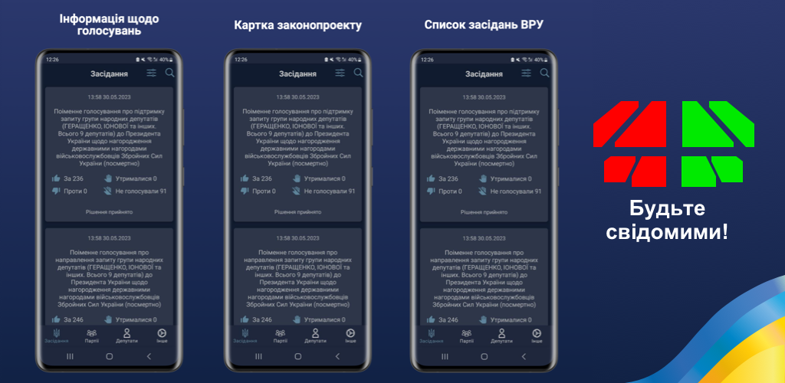

### Hi there 👋

 

## About we
- 👨‍💻 Development group from Ukraine.
- 🇺🇦 Russian warship FUCK YOU.
- 💬 Ask us about anything. 
- 📫 How to reach us: use bages below, pls.

## Write to us

## Projects

### Svidomist

This mobile application provides users with a convenient and accessible tool for viewing data on votes for draft laws in the Verkhovna Rada of Ukraine, as well as information on the votes of each individual party and its members.

